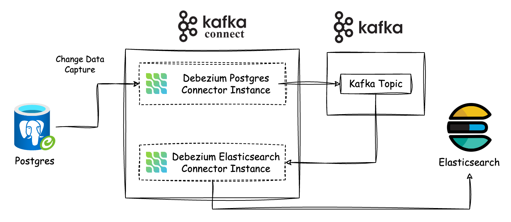

# Crawler Demo for 200LAB DevOps Course

In this course, we will set up the CI/CD and infrastructure for the crawler systems below on Kubernetes.

## Overview System

Crawler System: crawler posts + redis stream + consumer


Change Data Capture System: Postgres + Kafka Connect + Elasticsearch



API Service: Rust + Postgres + Elasticsearch


# crawler demo
## Init

### 1. Run crawler application

```bash
    docker-compose up -d

    # Check the port running
    netstat -lntp
```

### 2. Run database

### 3. Run migrate script
```bash
    cd migrate
    go get
    go run main.go tables.go init
    go run main.go tables.go migrate
    go run main.go tables.go 25012024_posts.go migrate
```

### 4. Run crawler service
    go run main.go

### 5. Run consumer service
    go run main.go tables.go

### 6. Dockerize a crawler service
docker build -t crawler:latest .

### 7. Dockerize a consumer service


// docker
docker init

# run another docker compose file
docker compose -f docker-compose-crawler.yaml up -d
docker compose -f docker-compose-stream.yaml up -d
docker compose -f docker-compose-api.yaml up -d
# check log
docker logs consumer -f
# format terminal
docker ps --format "table {{.Image}}\t{{.Ports}}\t{{.Names}}"
#create network
docker network create crawler

# Elasticsearch
http://localhost:9200/_cat/indices?v
http://localhost:9200/crawler-posts/_search

# research
kafka ui + keycloak + [okta]

docker image build -t quanle51297/crawler-demo .
docker build -t quanle51297/crawler-demo .


docker image build -t quanle51297/crawler-api .
docker image build -t quanle51297/consumer-app .
docker image build -t quanle51297/crawler-app .
docker image build -t quanle51297/crawler-website .

docker build -t quanle51297/crawler-api .
docker build -t quanle51297/consumer-app .
docker build -t quanle51297/crawler-app .
docker build -t quanle51297/crawler-website .


test action